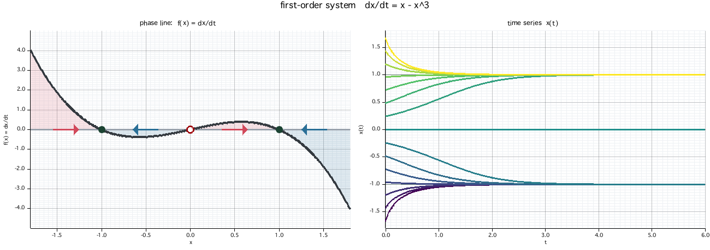

# 力学系ビジュアライザ（1 次元・2 次元・3 次元 / Rust + WebAssembly）

ページは[こちら](https://kaaatsu32329.github.io/dynamics/)から。

自励系の挙動をブラウザで可視化するワークスペース。ページ上部のタブで **1 次元** / **2 次元** / **3 次元** を切り替えられる。

**1 次元 `dx/dt = f(x)`** — 任意の関数 `f(x)` を文字列で与えると、
**f(x) のグラフ・相直線（流れの向き）・固定点の安定性・時系列 x(t)** を描画する。
解の挙動はすべて相直線上で理解できる:

- `f(x) = 0` の点が **固定点**（平衡点）。
- `f(x) > 0` の区間では x は増加（→）、`f(x) < 0` では減少（←）。
- 固定点での傾きが安定性を決める: `f'(x*) < 0` なら **安定**（●）、`f'(x*) > 0` なら **不安定**（○）。

**2 次元 `dx/dt = f(x,y), dy/dt = g(x,y)`** — 相平面に
**ベクトル場・ヌルクライン（f=0 / g=0）・固定点（ヤコビアンの固有値で分類）・軌道** を描画し、
粒子が流れに沿って動くアニメーションも再生できる。

**3 次元 `dx/dt = f(x,y,z), dy/dt = g(x,y,z), dz/dt = h(x,y,z)`** — 相空間に
**軌道（数値積分）・固定点（3×3 ヤコビアンの固有値で分類）** を描画する。
ドラッグで視点を回転でき、粒子が流れるアニメーションも再生できる（例: Lorenz・Rössler・Chen・Thomas・Halvorsen）。



## ワークスペース構成

| クレート | 種別 | 役割 | 依存 |
|----------|------|------|------|
| [`dyn-core`](crates/dyn-core) | lib | 数式パーサ・固定点検出・安定性判定・RK4 積分 | **依存ゼロ** |
| [`dyn-wasm`](crates/dyn-wasm) | cdylib | `dyn-core` を WebAssembly に公開（**ブラウザ版の計算エンジン**） | `wasm-bindgen` |
| [`dyn-cli`](crates/dyn-cli)   | bin | 方程式 → PNG / アニメーション GIF | `plotters` |

`dyn-core` は標準ライブラリのみに依存し、`no_std` 化や組込み用途への転用も視野に入る薄い数値コア。
**1 次元**のブラウザ版・CLI はいずれもこの同じコアを消費する薄い presentation 層で、
数式パース・固定点検出・RK4 積分という本質ロジックは Rust(WASM) が実行し、描画（canvas）と UI のみが JavaScript。

**2 次元・3 次元タブ**はブラウザ内の自己完結 JavaScript（独自パーサ＋RK4＋ヤコビアンによる固定点分類、
3 次元は固有値を解く 3×3 ヤコビアンと回転投影つき）で実装しており、Rust クレートには依存しない（`web/index.html` 内）。

## 使い方

### ブラウザ版（推奨）

```sh
./run.sh
```

これ一つで完結する:

1. wasm ターゲットと `wasm-bindgen-cli`（`Cargo.lock` と同版）が無ければ自動インストール
2. 未ビルド / ソースが更新されていれば WebAssembly を再ビルド
3. ローカル HTTP サーバを起動し、**既定ブラウザでページを開く**（Ctrl-C で停止＆後始末）

ポートは自動選択（`./run.sh 8080` で指定可）。方程式を入力（または例ボタン）すると即座に
再描画。パラメータ `p` `q` `r` を含む式（例 `r - x^2`、`r*x*(1 - x/q)`、`p + r*x - x^3`）では
含むものだけスライダーが専用行に現れ、分岐（固定点の生成・消滅）を動かして観察できる。
パラメータを含む式では **分岐図**（固定点 x* を掃引パラメータに対して描き、安定＝緑/不安定＝赤、
現在値を縦線で表示）も自動で表示される（複数パラメータ時は掃引対象を選択可）。
`▶ アニメーション再生` で粒子が相直線上を流れ安定固定点へ収束する
様子を表示。計算（パース・固定点・積分）はすべて Rust(WASM)、描画は canvas。

ビルドだけ・配信だけしたい場合は `./build-web.sh`（`--serve` で 8000 番配信）。

> `file://` で直接開くと ES モジュール/WASM の取得が CORS で失敗するため、HTTP 配信が必要。
> `web/pkg/` は `build-web.sh`（= `cargo build --target wasm32-unknown-unknown` + `wasm-bindgen`）が生成する。

ページ上部のタブで **1 次元 / 2 次元 / 3 次元** を切り替えられる。2 次元は自励系
`dx/dt = f(x,y)`, `dy/dt = g(x,y)` の相平面で、ベクトル場・ヌルクライン・固定点
（ヤコビアンの固有値で分類）・軌道を描画する（例: 減衰振り子・Van der Pol・Lotka-Volterra）。
3 次元は `dx/dt = f(x,y,z)`, `dy/dt = g(x,y,z)`, `dz/dt = h(x,y,z)` の相空間で、軌道と固定点
（3×3 ヤコビアンの固有値で分類）を描画し、ドラッグで回転できる（例: Lorenz・Rössler・Chen・Thomas・Halvorsen）。
2 次元・3 次元側は 1 次元に手を入れずに追加した自己完結 JS。

### CLI（静止画 / GIF）

```sh
# 静止画
cargo run -p dyn-cli -- "x - x^3"

# パラメータ付き（サドルノード分岐）
cargo run -p dyn-cli -- "r - x^2" --r 1 -o saddle.png
cargo run -p dyn-cli -- "r*x*(1 - x/q)" --r 1.2 --q 0.8   # 複数パラメータ p/q/r

# アニメーション GIF
cargo run -p dyn-cli -- "x*(1-x)" --gif -o logistic.gif --frames 120
```

主なオプション: `--xmin/--xmax`（x 範囲）, `--tmax`（積分時間）, `--n`（軌道本数）,
`--p`/`--q`/`--r`（パラメータ）, `--size WxH`, `--gif`, `--frames`。`-h` で一覧。

## 数式の記法

- 演算: `+ - * /`、べき乗 `^`、括弧、**暗黙の掛け算** `2x` / `x(1-x)`
- 関数: `sin cos tan asin acos atan sinh cosh tanh exp log(=ln) log10 log2 sqrt cbrt abs sign floor ceil round pow(a,b) atan2 min max mod`
- 定数: `pi e tau`、変数: `x`、パラメータ: `p` `q` `r`（式に現れたものだけ調整可能）

2 次元タブの式は変数 `x`, `y`、3 次元タブの式は変数 `x`, `y`, `z`（いずれもパラメータ非対応）。
演算・関数・定数・暗黙の掛け算は 1 次元と同じ。

## テスト

```sh
cargo test --workspace
```

- `dyn-core`: パーサ（単項マイナス・べき乗の優先順位・暗黙の掛け算・複数パラメータ）、
  固定点検出、サドルノード分岐、RK4 が解析解 `e^{-t}` に一致、などを検証。

## ギャラリー

| | |
|---|---|
| ロジスティック `x(1-x)` | 双安定 `x - x³` |
| サドルノード `r - x²` (r=1) | `sin(x)` |

`gallery/` 配下に出力例（PNG / GIF）。

## メモ（ツールチェーン）

- stable Rust でビルド可（ローカル開発は nightly でも可）。
- plotters は既定の `ttf`/font-kit が最新 nightly で壊れる（`pathfinder_simd`）ため、
  純 Rust の `ab_glyph` フォントバックエンドを使用し、システム TTF を実行時に登録している
  （`crates/dyn-cli/src/font.rs`）。
- ブラウザ版は `wasm-bindgen` を使用。`wasm-bindgen` **クレートと CLI のバージョンは一致必須**
  （本リポジトリは `0.2.125`）。CLI 不要の `trunk`/`wasm-pack` は使わず、`wasm-bindgen` を直接呼ぶ
  最小構成（`build-web.sh`）。描画と UI を HTML/CSS+canvas にしているのは、日本語表示が
  そのまま出せて軽量なため（重い計算はすべて Rust/WASM）。
